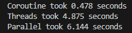
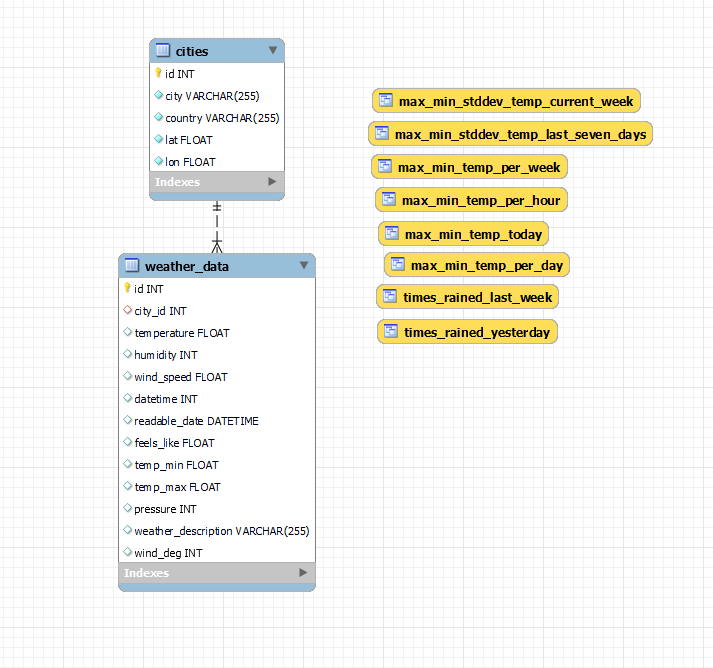

# WEATHER DATA GATHERING AND ANALYSIS API

## Tech stack

- Python
- MySQL
- FastAPI
- SQLAlchemy
- and more...

## How to run the API server

1. Clone the repository

2. Create a virtual environment
```python3 -m venv venv```

3. Activate the virtual environment on Linux
```source venv/bin/activate```
or on Windows
```venv\Scripts\activate```

4. Install the dependencies
```pip install -r requirements.txt```

5. Copy the .env.example file and rename it to .env

6. Fill the .env file with your credentials

7. Run the script to create the database
```python3 src/data/tables/create_all_tables.py```

8. Run the SQL queries from the src/data/sql_views folder to create the views. Don't forget to change the database name in the queries.

9. Run the dev server
```uvicorn src.main:app --reload```


## How to set up CRON jobs for data gathering and backup

1. Run the CRON wizzard script
```python3 src/cron/manage_cron.py```

2. Follow the instructions

3. You can run the wizzard again if you want to remove the jobs


## How to use

1. Open the app in your browser (default: http://localhost:8000)
2. Go to the docs (default: http://localhost:8000/docs)
3. Try out the endpoints
4. Build your own app using the API


## Benchmark



## EER diagram
